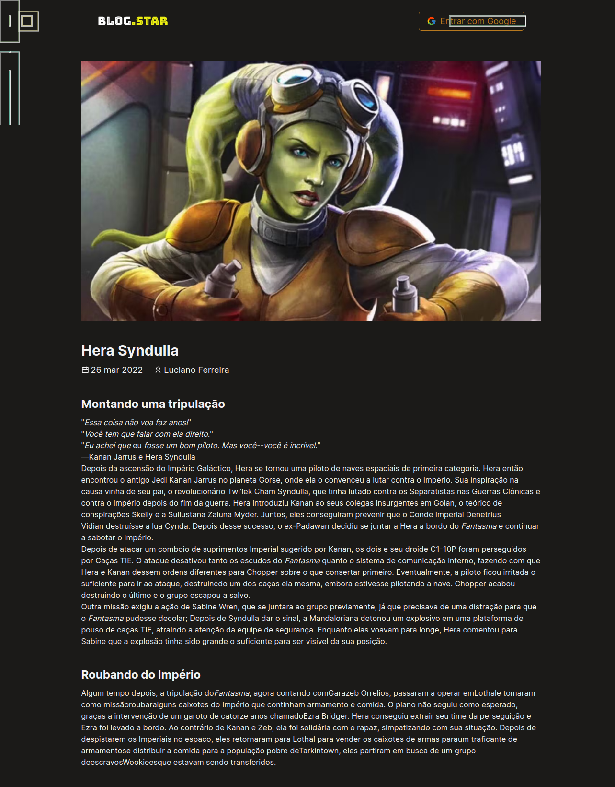

<h1 align="center">
    
</h1>

<p align="center">
  <a href="#-tecnologias">Tecnologias</a>&nbsp;&nbsp;&nbsp;|&nbsp;&nbsp;&nbsp;
  <a href="#-projeto">Projeto</a>&nbsp;&nbsp;&nbsp;|&nbsp;&nbsp;&nbsp;
  <a href="#-clonar">Download</a>
</p>

<br>

## 🚀 Tecnologias

Esse projeto foi desenvolvido com as seguintes tecnologias:

- [React](https://reactjs.org)
- [TypeScript](https://www.typescriptlang.org/)
- [Chakra](https://chakra-ui.com/)
- [Prismic](https://prismic.io/)

## 💻 Projeto

O Blog.Star é uma aplicação ideal para fãs de Star Wars poderem acompanhar histórias e curiosidades de seus personagens favoritos.

---

### Clonar repositório

```bash
$ git clone https://github.com/Ferreira94/Blog.Star.git
```

### 💻 Startar Projeto

```bash
# Vá para a pasta do projeto
$ cd blogstar
# Instale as depedencias
$ yarn
# Rode a aplicação
$ yarn dev
```

Acesse: http://localhost:3000/

Feito por Luciano Ferreira
